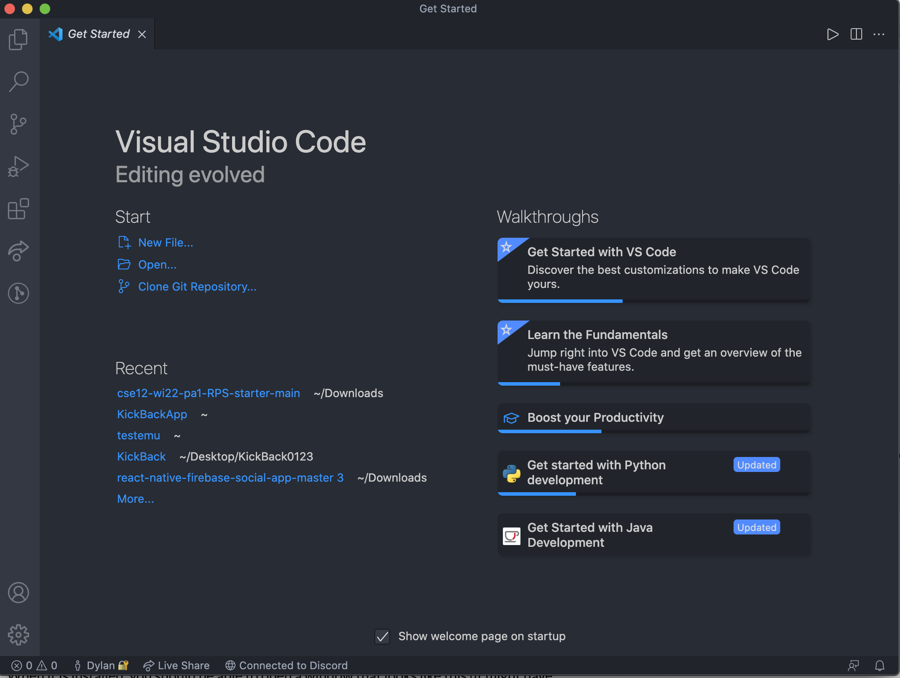

# Step 1 - Install VS Code
* Go download Visual Studio code from the Visual Studio Code
website [Here](https://code.visualstudio.com/).
* After downloading, when you open Visual Studio Code, your screen should look somewhat similar to this screen

 

# Step 2 - Remotely Connecting
* Install Open SSH
* Then look for your cse15lwi22 account through [this website](https://sdacs.ucsd.edu/~icc/index.php).
* Type  `$ ssh cs15lwi22zz@ieng6.ucsd.edu` in the terminal (replace zz with your respective letters)
* Your screen should look like this

# Step 3 - Run Some Commands
* Try some of these commands 

> `cd ~`

> `cd` 

> `ls -lat`

> `ls -a`

> `ls <directory>`

> `cp /home/linux/ieng6/cs15lwi22/public/hello.txt ~/`

> `cat /home/linux/ieng6/cs15lwi22/public/hello.txt`

# Step 4

