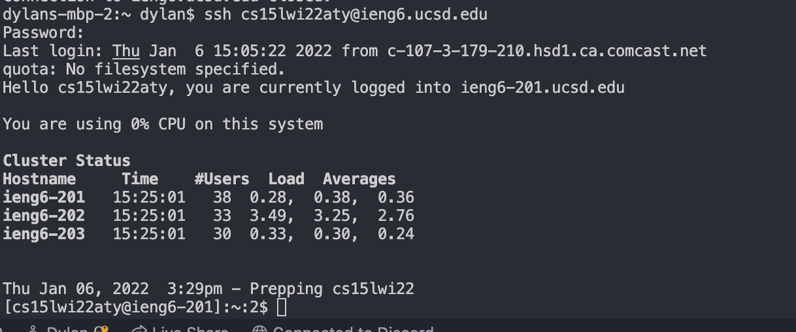
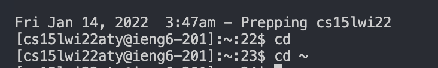
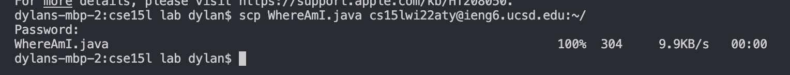
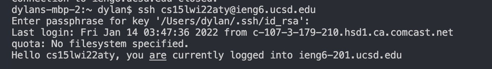
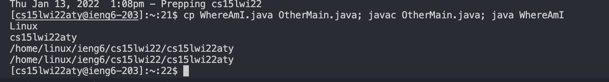
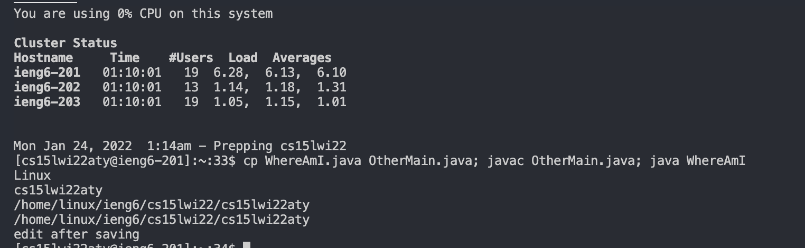

# Step 1 - Installing VScode

- Go download Visual Studio code from the Visual Studio Code
  website [Here](https://code.visualstudio.com/).
- After downloading, when you open Visual Studio Code, your screen should look somewhat similar to this screen

# Step 2 - Remotely Connecting

- Install Open SSH
- Then look for your cse15lwi22 account through [this website](https://sdacs.ucsd.edu/~icc/index.php).
- Type `$ ssh cs15lwi22zz@ieng6.ucsd.edu` in the terminal (replace zz with your respective letters)
- Your screen should look like this

# Step 3 - Trying Some Commands

- There a numerous commands that we can use

- Here are 2 examples that I chose

> `cd ~` changes directory to home directory

> `cd` changes directory

- This is an example of `cd` and `cd ~` in the terminal

# Step 4 - Moving Files with scp

- To move files from the local computer to a remote computer we need to use scp

- To start, run javac and java on your local computer

- Then in the terminal type

`scp WhereAmI.java cs15lwi22zz@ieng6.ucsd.edu:~/`

- Now the file should be in the remote server as shown below:

# Step 5 - Setting an SSH Key

- To log into our remote computer without a password we use something called **ssh keys**

- To set this up we need to type `ssh-keygen` on the **client**

- We then need to copy the public key over to our account on the server

- On the server

`$ mkdir .ssh`

- Logout
- On the client

`$ scp /Users/joe/.ssh/id_rsa.pub cs15lwi22@ieng6.ucsd.edu:~/.ssh/authorized_keys`

- Use your username and the path you saw in the command above

- This is what it should look like when working:

# Step 6 - Optimizing Remote Running

- To run commands directly in the remote server then exit type:

`$ ssh cs15lwi22aty@ieng6.ucsd.edu "ls"`

- ls is just an example command

- If we want to run multiple commands at once we type:

`$ cp WhereAmI.java OtherMain.java; javac OtherMain.java; java WhereAmI`

- Here is an example:

- After making an edit and saving it to the WhereAmI.java file, I counted the keystrokes it took for me to run it

- I first did the up arrow + enter to do the command: `$ ssh cs15lwi22aty@ieng6.ucsd.edu`

- I then command C + command V'd the `$ cp WhereAmI.java OtherMain.java; javac OtherMain.java; java WhereAmI` command

- So in total, that was 4 keystrokes to run after editing the file

- Here's a picture:

