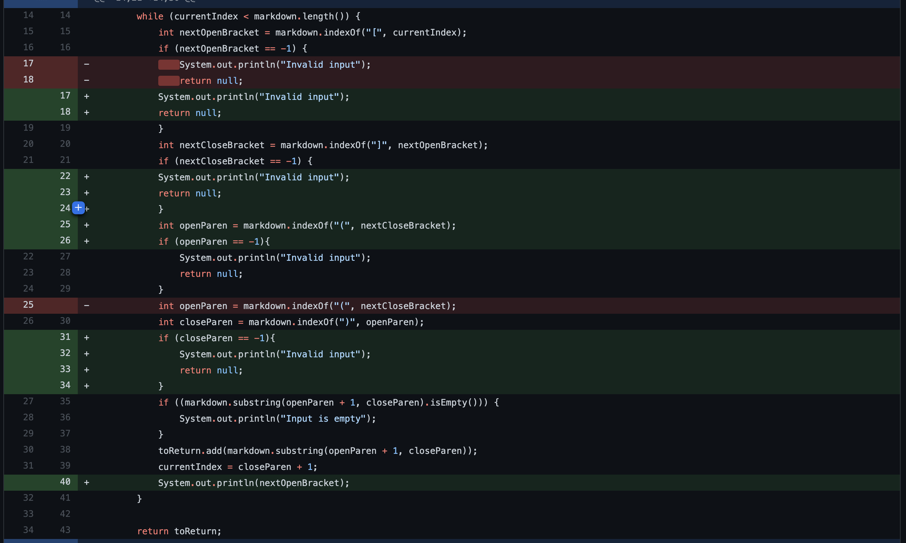
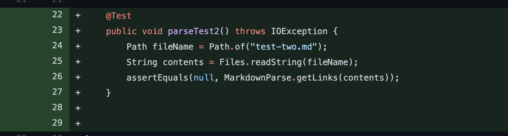
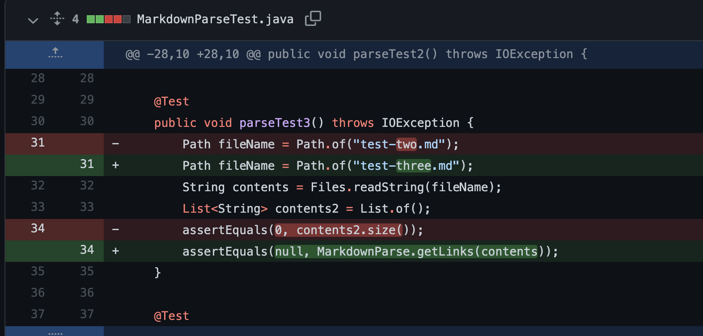
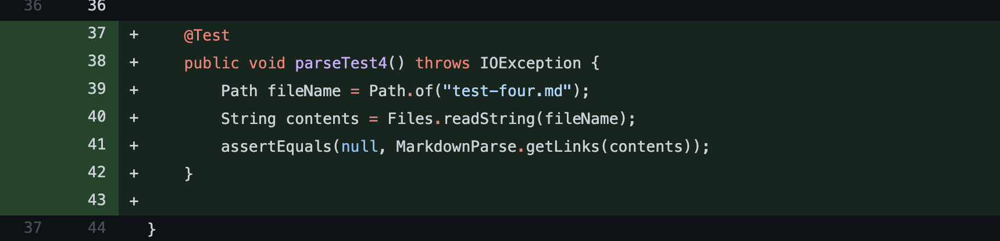
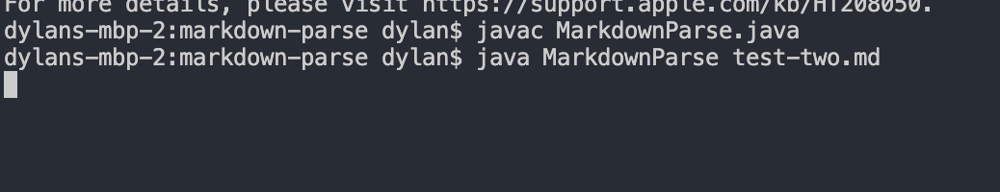
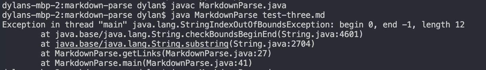
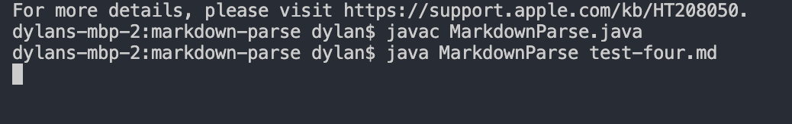

# Screenshot of Code Changes

- These are all of my code changes that I made to fix my failure-inducing inputs (All three of the fixes are on the same screenshot)
  

- Here are the changes I made to MarkdownParseTest.java to fix my failure-inducing inputs.

> First Error:

> Second Error:

> Third Error:

# Link to Test Files

- [First Error](https://github.com/dslee01/markdown-parse-1/blob/master/markdown-parse/test-two.md)

- [Second Error](https://github.com/dslee01/markdown-parse-1/blob/master/markdown-parse/test-three.md)

- [Third Error](https://github.com/dslee01/markdown-parse-1/blob/master/markdown-parse/test-four.md)

# Symptoms

- Symptom of the first error (Infinite loop)
  

- Symptom of the second error (IndexOutOfBoundsException)

- Symptom of the third error (Infinite loop)

# Descriptions

- First Error:

> For the first error, instead of having the input be `[new link](https://)` I had the file contain `[new link)(https://)`. When I ran it, it caused an infinite loop and I added a print statement to see it more clearly. As shown in the screenshot, it is stuck in the while loop because it can't find the nextCloseBracket when doing the indexOf call. To fix this, I added an if statement to check if the indexOf call returned -1, and if did to just return null to break out of the loop.

- Second Error:

> For the second failure-inducing input, I created a file which had the code `[new link]` in it, with not `()` at the end. When I ran it, the output was an indexOutOfBoundsException. This was because in the line starter code `toReturn.add(markdown.substring(openParen + 1, closeParen));`. When we try to add it to the `toReturn` ArrayList, we take the substring from openParen and closeParen. Since there are no `()` in the failure-inducing input, both of their values are -1, and thus it creates an indexOutOfBoundsException.

- Third Error:

> Lastly, the final failure-inducing input, was when I added the code `(new link)(https://)` into the test-four.md file. When I tried running the program with the file as an input, it led to an infinite loop. This happened because it couldn't find the nextOpenBracket and nextCloseBracket because there were none. This led to a -1 output, resulting in the function being stuck in the while loop infinitely. To fix this, I added if statements to check if the value of the indexOf call for nextOpenBracket and nextCloseBracket are -1, and if they are, to just return null and print out "Invalid Input".
