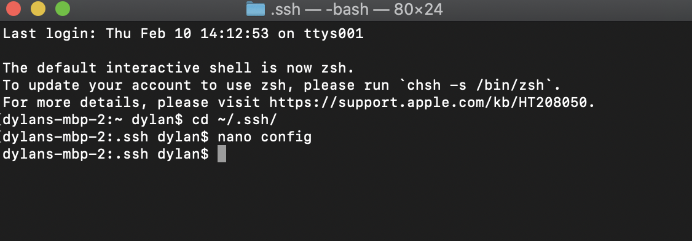

# Streamlining ssh Configuration

- In the two screenshots below, I demonstrate going into my `~/.ssh/config` file and editing it through the terminal using the `nano config` command

> Accessing the file

> Editing the file

- After changing the config file, I then logged into my account using the `ssh ieng6` command instead of the longer previous one

- Lastly, I did the `scp` command to copy a file to my account using the alias

