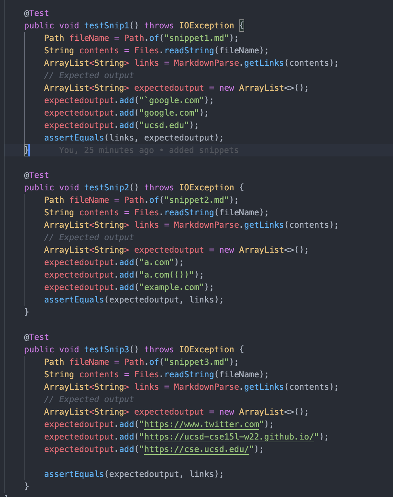
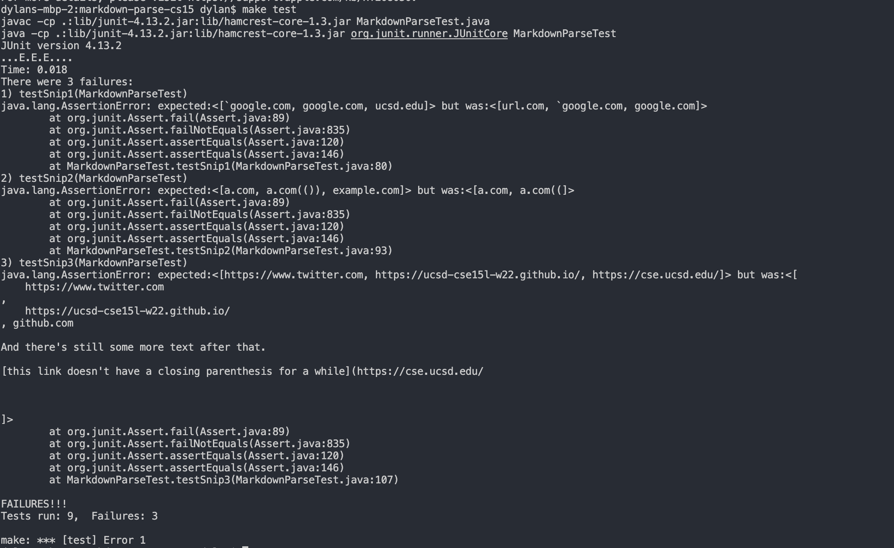
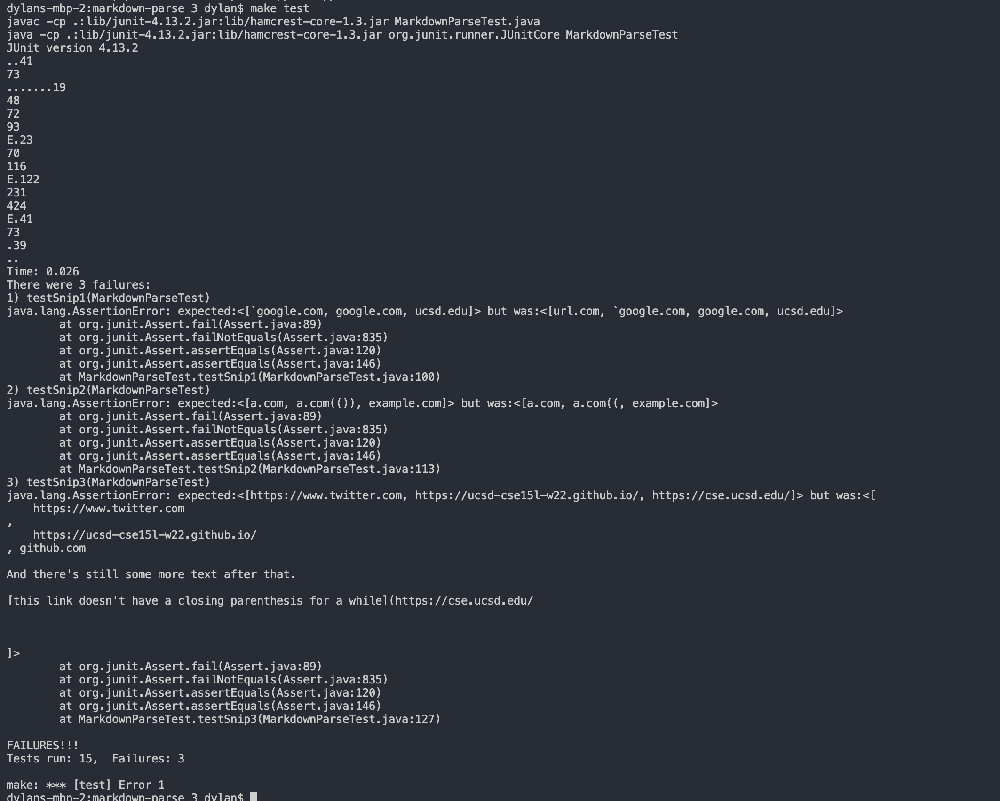

# MarkdownParse Tests

- Here is a screenshot of the tests I put in my own version of MarkdownParseTest.java and in the MarkdownParseTest.java file of the repository I reviewed:

# Test Outputs

- Here are the results of the tests on my version of MarkdownParse:

- Here are the results of the tests on the version of MarkdownParse I reviewed with my group:

- For both repositories, the implmentation for MarkdownParse failed all 3 snippets of code.

# Answers

- For snippet 1, I believe that to fix the error, we would need more than 10 lines. The errors we have is that we have to check for an inline comment on the brackets or parenthesis on the code, and we need to make sure the markdownparse works when there are two closebrackets. For the inline comment, we would need to keep track of the indexes of the two backticks in the string, and then check if the backticks actually comment out an open/close bracket/parenthesis. After doing this, we would need to fix the error of it not recognizing a second closebracket, which would in total take more 10 lines.

- For snippet 2, I think we can fix the error in 10 lines or less because to fix the nested bracket error, we just need to change the condition of the if statement in MarkdownParse.java to `"]("` instead of just `"]"` to have the program not get confused by brackets nested inside. We can apply the same logic for the close parenthesis and have it search for a close parenthesis with an index at the length of the string.

- For snippet 3, we can use the .trim() method to get rid of the spaces at the beginning and at the end of the string inside the parenthesis. However, the last part of snippet 3 will take more lines to solve as our old strategy of taking the index of `"]("` to find where the closeBracket is does not work because there is another `"]("` in the same block of code. This means we have to revise our old strategy for closeBracket, so I feel like this would take more than 10 lines.
