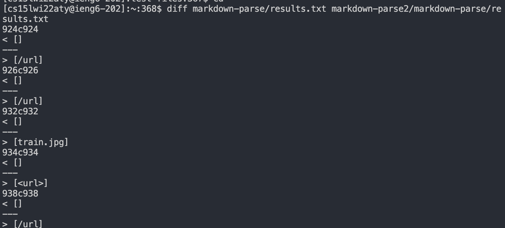
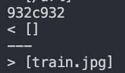
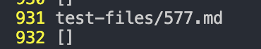
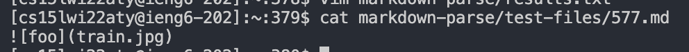
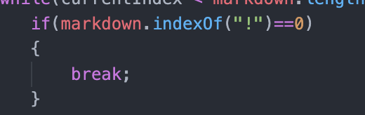
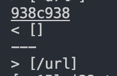
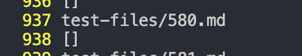
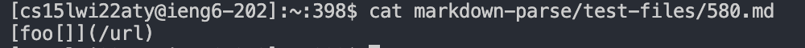
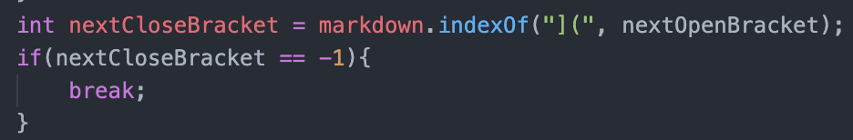

# How I Found Each Test

- For the two tests I chose, I found the tests with different outputs using the `diff` command on my `resullts.txt` and the provided `results.txt`. Here is the output of me running `diff`:

# First Test 

- The first test I chose was the test on line 932 in the `results.txt` file 

- After calling `vim markdown-parse/results.txt`,  The output on line 932 was:

- I then called `cat markdown-parse/test-files/577.md` and the output was:

- My own markdown-parse for this said the output should be `[]`, while the implementation given stated that the output should be `[train.jpg]`. I believe that my markdown-parse is correct because `getLinks()` is being called onto an image link instead of a regular link. So, the output should be empty instead of `[train.jpg]`. To fix this bug, you would have to check for an exclamation mark at index 0 and we did that in our markdown-parse code here:

# Second Test

- The second test I chose was the test on line 938 in the results.txt file.

- After calling `vim markdown-parse/results.txt`,  The output on line 938 was:

- I then called `cat markdown-parse/test-files/580.md` and the output was: 

- My markdown-paarse implmentation for this specific test was incorrect because it did not cover this specific bug in our code. Since there is a nested bracket in the first part, our program does not recognize it as a link. To fix this issue, a simple code fix would be to change our code to search for the index of `](` instead of just `]`, so it does not get confused with nested brackets. An implementation might look like this:

